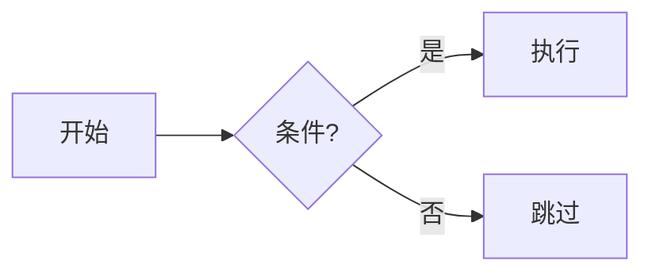
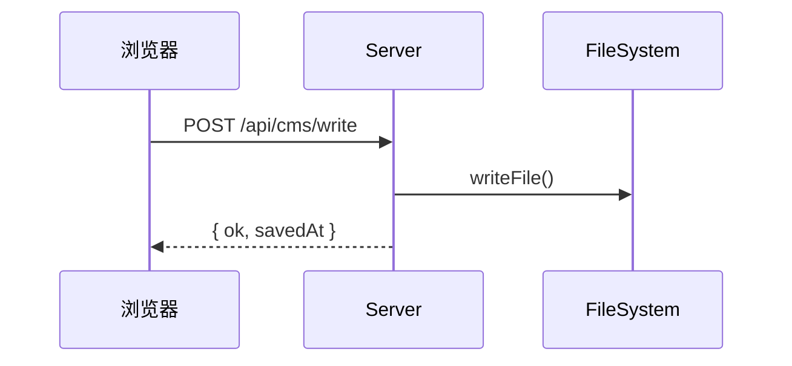
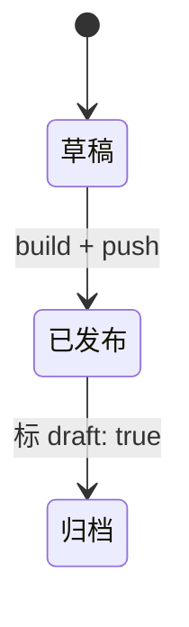

# 视觉表现选型

写技术 / 项目类博文时，**主动建议**下面的可视化元素，让正文更易读。本项目已经接好的工具：

- **Mermaid** 图——客户端 lazy load，约 20 种图类（flowchart / sequence / class / state / pie / mindmap / gitgraph / timeline / sankey / quadrant / erDiagram 等）；博文里有 mermaid 块时才动态加载 ~700KB，没有则零负担
- **Markdown 表格**——自动套样式：表头粉色底 + 首列微底色当行标签 + 列分隔 + 行 hover + 窄屏横滑 + 边缘渐隐
- **Shoka directives**（`:::info / :::tip / :::warning / :::danger / :::spoiler / :::fold` —— 见 `shoka-syntax.md`）
- **代码块**——自动 macOS 窗口风（3 圆点 + lang 标签 + 「放大」「复制」按钮），Shiki `github-light` 高亮主题

## 内容类型 → 推荐表现

| 你想表达 | 用什么 | 一句话 why |
|---------|--------|-----------|
| 流程 / 决策 | mermaid flowchart | 文字描述 if/else/while 永远不如图直观 |
| 系统架构 | mermaid graph TD | 前后端、CDN、DB 多层关系一图看清 |
| 类 / 对象关系 | mermaid classDiagram | OOP 文档专用 |
| 时间线 / 演进 | mermaid gitgraph 或 timeline | 项目里程碑、版本演化 |
| 状态机 | mermaid stateDiagram-v2 | 订单状态 / 登录流 / 审批流 |
| 时序 / 调用链 | mermaid sequenceDiagram | API 请求往返、消息传递 |
| 字段对比 / 配置矩阵 | Markdown 表格 | 配置项 / 默认值 / 含义并排 |
| 步骤拆解 | ordered list + code block 穿插 | 安装、复现、操作步骤 |
| Q&A / FAQ | `:::fold[问题]` | 默认收起来不打断主线 |
| 实验记录 / 题外话 | `:::fold[实现细节]` | 主线想干净又不想丢内容 |
| 警告条件 | `:::warning` | 不可逆 / 破坏数据的操作 |
| 友情提示 | `:::tip` | 优化技巧、加速窍门 |
| 重要补充 | `:::info` | 教程里的「注意 X」 |
| 严重坑 | `:::danger` | 「不要 / 绝不」级别 |
| 配置示例 | code block + lang | yaml / json / sh / ts |

## Mermaid 速例（最常用 3 种）

### 流程图
````markdown

````

### 时序图
````markdown

````

### 状态机
````markdown

````

完整 ~20 种支持的图类：flowchart / sequenceDiagram / classDiagram / stateDiagram-v2 / pie / mindmap / gitgraph / timeline / quadrantChart / sankey / erDiagram / journey / requirementDiagram / c4 / xychart 等。具体语法参考 [mermaid 官方文档](https://mermaid.js.org/)。

## 反模式

- ❌ **一篇博文塞 5+ 个 mermaid**——视觉饱和，每张图 ~600KB lazy load 也不便宜
- ❌ **简单 if/else 用 flowchart**——3 行文字更清楚，留 mermaid 给真复杂的分支
- ❌ **Mermaid 节点标签 > 15 个汉字**——会撑出画布；改用英文短词或拆成两张图
- ❌ **3 列 1 行 + 长文塞表格**——退化成段落更顺；表格的价值在「多行可对比」
- ❌ **配置项放正文段落**——一定用 code block + lang，不要写成 inline code 拼接
- ❌ **故障排查全用 H3 小标题**——用 `:::fold[症状: XXX]` 收起每个故障，主线干净

## 何时不需要任何视觉元素

- 「碎碎念」分类的随笔 / 情绪类内容——一段到底反而真实
- 短文（< 800 字）——视觉元素不该比正文还多
- 完全文学性的内容——配图（hero）足够，无需图表
