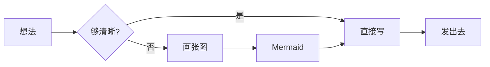

这篇文章把站点支持的全部小魔法摆出来——
不是为了炫技，是为了下次写博文时能直接抄。

把它当作 cheatsheet 用就好。

## 一、文字样式

最基础的 Markdown 内联格式：

- **粗体**用 `**双星号**` 包裹
- *斜体*用 `*单星号*` 包裹
- ~~删除线~~用 `~~双波浪~~`
- `内联代码`用 反引号 包裹
- [带链接的文字](https://wizardhehejun.github.io/)用 `[文字](url)`
- 上标：H~2~O / 下标：E=mc^2^ —— 这个本站默认 markdown 不支持，需要插件

**组合也可以**：粗体里的 *斜体* 和 `代码片段`，混排没问题。

## 二、标题层级（驱动右侧 TOC）

桌面端右侧 TOC 是客户端扫描 `.prose h2, .prose h3` 自动生成的——所以**只有 h2、h3 进目录**。h4 及以下不进。

### 2.1 这是一个 h3

它会在 TOC 里以 `2.1` 缩进显示。

### 2.2 另一个 h3

scroll-spy 会高亮当前最贴顶部的那一项（96px 缓冲带）。

#### 这个 h4 不会进 TOC

正常显示，但不参与目录。

## 三、列表

### 无序列表

- 第一项
- 第二项
  - 嵌套：缩进 2 个空格
  - 第二个嵌套项
    - 三级嵌套也可以
- 第三项

### 有序列表

1. 准备种子
2. 翻土播种
3. 日常浇水
4. 等待绽放

### 任务列表

- [x] 写一篇 Mermaid 示例
- [x] 写一篇功能全展示
- [ ] 加 hero 图
- [ ] 让樱看到这篇

## 四、表格

| 视口 | 名称 | 主要特征 |
|------|------|----------|
| ≤ 640px | 移动 | 单列堆叠 + drawer 抽屉 |
| 641–960px | 平板 | sidebar 折顶部横向 |
| 961–1280px | 桌面 | 双栏 + 完整 sidebar |
| > 1280px | 大屏 | 解锁更宽内容（最多 1680） |

表格自动玻璃化，hover 时行底色会轻轻变化。

## 五、引用

> 此后，将有群星闪耀，因为我如今来过。
> 此后，将有百花绽放，因为我从未离去。

多行引用——每一行前面都加 `>`。引用块在玻璃主题里会带一条左侧色条。

## 六、代码块

### 6.1 macOS 窗口风

每个代码块都会自动加 36px 的 header bar——左侧 3 个圆点，中间显示语言，右侧两个按钮：**放大**（portal 到 body 全屏展示）和 **复制**（点击有 ✓ 反馈）。

```javascript
// JavaScript: 一个简单的递归
function fibonacci(n) {
  if (n <= 1) return n;
  return fibonacci(n - 1) + fibonacci(n - 2);
}

console.log(fibonacci(10)); // 55
```

### 6.2 多语言支持

```python
# Python: 列表推导式
flowers = ['rose', 'tulip', 'lily']
shouts = [f"Hello, {f}!" for f in flowers if len(f) > 3]
print(shouts)
```

```rust
// Rust: 模式匹配
fn describe(n: i32) -> &'static str {
    match n {
        0 => "zero",
        1..=9 => "single digit",
        _ => "many",
    }
}
```

```css
/* CSS: 站点的玻璃变量 */
:root {
  --glass-bg: rgba(255, 255, 255, 0.55);
  --glass-blur: blur(18px) saturate(180%);
}
```

```bash
# Shell: 部署命令
git add .
git commit -m "post: new feature showcase"
git push
```

### 6.3 内联无样式块

````markdown
没有语言标识的代码块，header 中间不显示标签：

```
plaintext 内容
```
````

## 七、图片：自动转 figure + lightbox

只要一段里**只有一张图**且 `alt` 非空，就会自动转成 `<figure>` + 居中 + figcaption。点击图片可以放大（lightbox），支持滚轮缩放、双击 toggle 100%↔250%、缩放后拖拽平移。


如果 `` 的 alt 为空，或同段里有多张图，**保持 inline 渲染**——不会强制转 figure。

## 八、Callout 四件套

四种颜色对应四种语气：

:::info
**信息块（蓝色）**——用于补充说明、背景信息、教程里的「Step-by-step 注意事项」。
:::

:::tip
**建议块（薄荷绿）**——比 info 更亲切，适合写「关键决策」「推荐做法」。
:::

:::warning
**警告块（琥珀色）**——提醒副作用 / 注意条件 / 踩过的坑。技术笔记里的「这里有陷阱」就用它。
:::

:::danger
**危险块（玫红色）**——破坏性操作、不可逆动作、重大坑。比 warning 更严重。
:::

callout 内部可以放**粗体**、列表、`代码`、甚至代码块：

:::tip
推荐的命令：

```bash
npm run build
npm run dev
```

- 先 build 验证
- 再 push
:::

## 九、Spoiler 剧透块

适合写情感重的话，或者不想被搜索引擎过分抓但又想留下的内容。点击 / hover / 按 Enter / Space 解锁。

:::spoiler
其实第一次看到这个博客上线的时候，我偷偷开心了好久——尽管嘴上说着「不过如此啦」。但谁让美丽的女孩子也会害羞呢～♪
:::

:::warning
spoiler 里的内容**仍然在 HTML 源码里**——Pagefind 能搜到，搜索引擎也能爬到。不是真隐藏，只是默认收起。真要隐藏的话，用 `data-pagefind-ignore` 包裹元素。
:::

## 十、Fold 折叠块

用原生 `<details>`——零 JS，点击展开。适合放「题外话」「实现细节」「不打断主线的拓展阅读」。

:::fold[点开看：本站使用的字体栈]
正文用 **LXGW WenKai Screen**（霞鹜文楷 屏幕版），通过 jsDelivr CDN 按字符 chunk 加载：

```html
<link rel="stylesheet" href="https://cdn.jsdelivr.net/npm/lxgw-wenkai-screen-webfont@1.7.0/style.css">
```

global.css body 字体链：
`'LXGW WenKai Screen', 'LXGW WenKai', -apple-system, 'Segoe UI', 'PingFang SC', 'Microsoft YaHei', sans-serif`

不要再加 Atkinson 之类英文字体——对中文无效。
:::

:::fold[点开看：本站的玻璃 CSS 变量]
```css
:root {
  --glass-bg: rgba(255, 255, 255, 0.55);
  --glass-border: 1px solid rgba(255, 255, 255, 0.45);
  --glass-shadow: 0 8px 32px rgba(31, 38, 135, 0.15);
  --glass-blur: blur(18px) saturate(180%);
}
```

要兼容 Safari → 同时写 `backdrop-filter` 和 `-webkit-backdrop-filter`。
:::

## 十一、Mermaid 图表

```` ```mermaid ```` 代码块会被客户端 lazy load 渲染——不含 mermaid 块的页面零 JS 增量。



完整图类示例（流程图 / 时序图 / 状态图 / 类图 / 甘特图 / 饼图 / 思维导图 / ER 图 / Git 图 / 四象限图）见 [Mermaid 画图实例](/blog/mermaid-demo/)。

## 十二、分隔线

用三个或更多 `-` / `*` / `_`：

---

分隔线在玻璃主题里是一条带着渐变的细线，比纯灰色更柔和。

## 十三、其他你可能不知道的细节

:::info
**这些功能不需要在 markdown 里写——自动生效**：

1. **TOC 桌面侧栏**——左侧 fixed 栏，滚动平滑跟随 hero
2. **TOC 移动模式**——header 位置浮替代 ticker，右下角 FAB（顶/底/折叠）
3. **阅读进度环**——TOC 左侧的粉色 SVG 圆环
4. **header 自动隐藏**——下滑藏 / 上滑现 / 贴顶 80px 永远显示
5. **背景 parallax**——滚动时背景图 Y 轴跟着滑
6. **鼠标拖尾**——`◇ ◇ △` 几何混搭，触屏自动跳过
7. **giscus 评论**——文章底部，玻璃主题
8. **Pagefind 搜索**——`/` 全局打开
9. **代码块复制 / 放大**——hover 代码块右上角
10. **图片 lightbox**——点任意正文图打开
:::

## 写在最后

这篇文章本身就是它演示的所有功能的活样本——
从 TOC 跟随、callout 配色、代码块 macOS 风、Mermaid 渲染、到 figure lightbox，
你**看到的每一个细节**都可以在源码里翻到对应的 markdown 或配置。

下次想用某个功能不记得语法时，回来抄一抄就行。

> 美丽的事物从来不需要复杂的咒语——
> 一段文字、一个 `:::`、一个三连反引号，就足够让画面发生。
