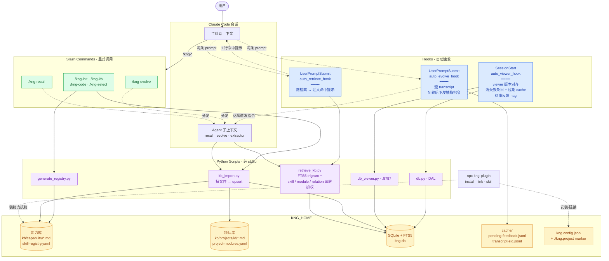
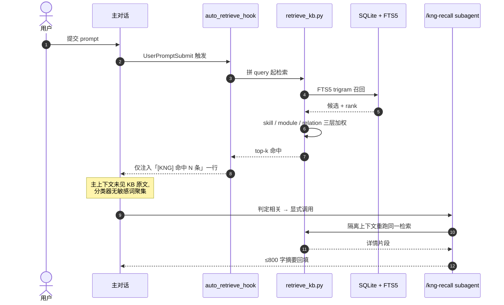
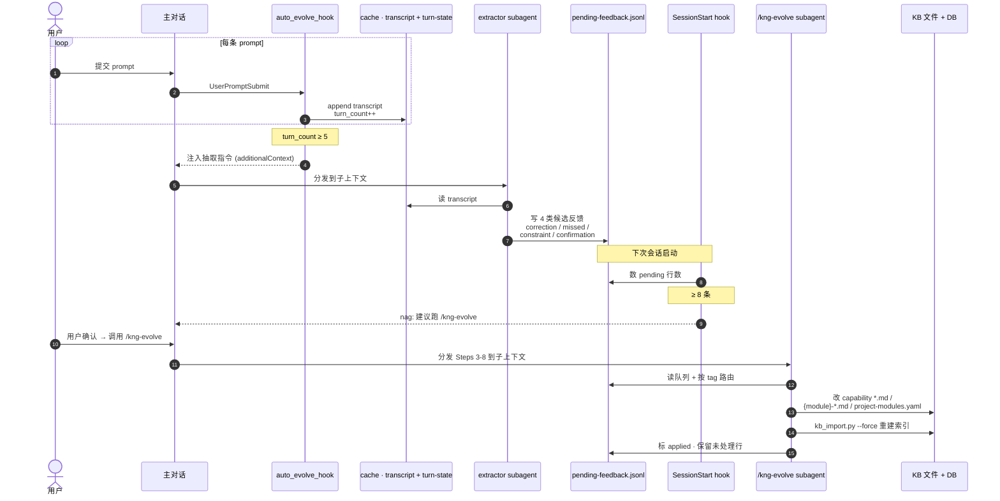
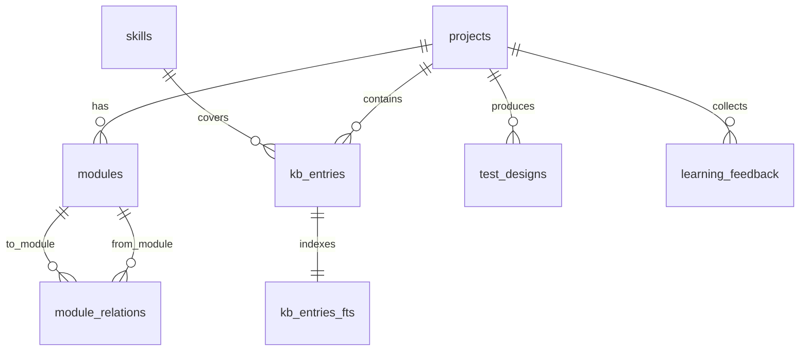

## 是什么

KNG（**K**nowledge-driven **N**ext-**G**en Agent Framework）是我做的一个 Claude Code 插件，核心思想是：**让 AI 拥有可累积、可迁移的领域记忆**，而不是每次对话从零开始。

一句话概括：**双知识库（能力库 + 项目库）+ 自动检索 + 自动学习**——让 AI 在你的项目里越用越准。

## 为什么做

用 Claude Code 久了发现一个矛盾：模型在通用问题上很强，但每次进入一个具体项目，那些只有团队内部才知道的约定（业务模块、历史踩坑、命名规范、被否决过的方案）模型都不知道——你只能反复贴上下文，或者每次都重新解释一遍。

我想要的是：**第一次告诉 AI 一个约束，以后所有任务都自动遵守**。

## 核心架构

| 知识库 | 位置 | 装什么 |
|--------|------|--------|
| **能力库** | `~/.kng-plugin/kb/capability/` | 通用方法论、可复用技能（如「测试用例设计法」「代码审查 checklist」） |
| **项目库** | `~/.kng-plugin/kb/projects/<id>/` | 项目业务模块、历史 bug 模式、约束规范 |

数据存在 SQLite 里，用 FTS5 全文检索 + trigram 分词器（中文友好，无需 jieba）。

### 整体架构图

四层结构：**接入**（用户 + npm CLI） → **Claude Code 会话**（主对话 + Agent 子上下文） → **触发层**（自动 hooks + 显式 slash commands） → **执行层**（纯 stdlib Python 脚本） → **存储层**（`KNG_HOME` 下的双 KB + SQLite + cache + 配置）。



几个值得在图里专门看的细节：

- **两条 UserPromptSubmit hook 并行存在**——一条把"提醒"塞回主上下文（召回回路），一条悄悄攒 transcript 等满了下发抽取指令（演化回路），互不干扰
- **subagent 是隔离上下文**——`/kng-recall` 和 `/kng-evolve` 的实际工作都在子上下文跑，主对话只接结论，避免被检索原文/反馈队列污染
- **Python 脚本是"无状态执行器"**——所有"懂语义"的事（模块发现、关系抽取、反馈归类）都甩给 Claude 自己读 SKILL.md 完成，脚本只做关键词匹配 + FTS5 + 规则加权
- **文件和 DB 是双向同步的**——`kb_import.py` 把 `*.md` 灌进 SQLite 供检索用，但 Markdown 仍是事实源（可走 git diff 审计）

## 两个让我特别得意的设计

**1. Hint + on-demand 的检索机制**

每次用户提交 prompt，hook 自动跑一次知识库检索——但**只往上下文注入一行命中数提示**，不带 KB 文字内容。Claude 看到提示后再决定要不要调用 `kng-recall` skill 加载详情。这样做有两个收益：

- **结构性绕开 API 输入分类器**：业务术语（fuzz、安全测试等）密集时，直接注入会被 Anthropic 的安全分类器拦截整段对话。把"提醒信号"和"业务内容"分到两个通道，分类器永远看不到敏感词聚集
- **不污染主对话上下文**：详情加载在 subagent 隔离上下文里跑，主助手只看摘要



**2. 自动学习闭环**

对话进行 5 轮后，hook 启动 extractor subagent，从最近的 user prompt 里抽 4 类候选反馈（correction / missed / constraint / confirmation），写入 pending 队列。攒到 8 条会主动邀请用户跑 `/kng-evolve` 做归并审核——**只有用户确认才落进 KB，AI 永远不能自动改写知识库**。



两个图放在一起看的妙处：召回回路是**单次同步流**（hook → hint → 主对话决策 → subagent → 摘要回填），演化回路是**N 轮累积 + 跨会话异步流**（每轮攒 → 满 5 轮抽取 → 攒 8 条 → 下次会话 nag → 用户确认 → 子上下文写库）。两条回路共用一对 `UserPromptSubmit` hook，但状态分别落在 `transcript-sid.jsonl` 和 `pending-feedback.jsonl` 里，互不踩。

## 安装

```bash
npx kng-plugin install
# 或在 Claude Code 里：
# /plugin marketplace add WizardHeHeJun/kng
# /plugin install kng
```

## 命令面板（5/22 补）

Claude Code 里直接调用：

| 命令 | 用途 |
|------|------|
| `/kng-init <project-id>` | 初始化项目库（支持 `--from-lark` 从飞书文档自动提取模块+关系） |
| `/kng-kb list / add / import` | 列出 / 交互添加 / 从飞书递归导入知识条目 |
| `/kng-code import / link` | 把本地文件导入 KB；文档 ↔ 代码元数据互链 |
| `/kng-evolve` | 回顾产出 → 路由反馈回 KB（学习闭环） |
| `/kng-recall [query]` | 按需加载详情（auto-retrieve hint 提示命中时调用） |
| `/kng-select [project-id]` | 切活跃项目库 |

CLI（终端执行）：

```bash
npx kng-plugin install / uninstall
npx kng-plugin link <project> [dir]       # 把当前目录链到某个项目库，自动追加 .gitignore
npx kng-plugin unlink [dir]
npx kng-plugin which                      # 看当前目录链到哪个项目
npx kng-plugin skill install <url|path>   # 从 URL 或本地装能力库技能
npx kng-plugin skill list / remove
```

## SQLite + FTS5 trigram：中文检索的天然解法

中文全文检索是个老问题——按空格切分行不通（中文不分词），引入 jieba 又意味着加一个重依赖、维护一份词典、处理 build 期的初始化。早期 KNG 是纯文件模式（YAML + Markdown），全文搜全靠 `grep` 暴力扫——库小的时候勉强能用，模块多起来就开始肉眼可见地慢。

后来发现 SQLite 3.34+ 自带的 FTS5 提供了一个 `tokenize='trigram'` 选项——专门为"无分词语言"设计：

- 把每个文档拆成所有可能的 3 字符片段（trigram）建索引
- 查询时把 query 也切成 trigram，按 OR 匹配
- 效果等价于"子串匹配 + 索引加速"，**完全不需要分词器**

KNG 对中文 query 做了一点改造——按 4 字符滑动窗口切短再 OR 拼接，召回率更稳：

```sql
-- query: "商店系统与哪些模块关联"
-- 切成: "商店系统" OR "店系统与" OR "系统与哪" OR ... OR "块关联"
SELECT * FROM kb_entries_fts WHERE content MATCH ?
```

召回回来不直接当结果用——还会再叠三层权重：

1. **技能注册表 boost**：query 命中某个能力库技能的覆盖标签 → 该技能涉及的文档加分
2. **检测到的模块加权**：query 提到具体模块名（如"商店"）→ 该模块下的文档加分
3. **关联模块加权**：检测到的模块在知识图谱里关联到的其他模块 → 文档也跟着加分

三层叠加排序之后给上下文注入。

不想要 DB 的人，删 `kng.config.json` 里的 `db_path` 字段即可——纯文件模式（YAML + Markdown）自动退回。功能上少了全文检索速度优势和 Web 可视化，但写入和审计完全走 git，更适合极度强调"知识库就该是文本文件"的场景。

## Web 可视化：会自动升级的本地查看器

DB 模式专属——一行命令起一个本地查看器看库里的状态：

```bash
python kng-plugin/scripts/db_viewer.py --db ~/.kng-plugin/kng.db
# 默认 http://127.0.0.1:8787
```

里面能看到：

- **Dashboard 总览**：项目数 / 模块数 / 知识条目数 / 反馈数一眼可见
- **数据浏览**：分页，按 tab 拆「文档」「代码」，关联标签超过 3 个自动折叠
- **全文搜索**：走 FTS5 trigram，没命中时回退 LIKE
- **模块关联图谱**：4 种关系（`depends_on` / `feeds_into` / `shares_state` / `triggers`）可视化展开
- **模块详情页**：点表格里的模块 ID 或标签直接跳转
- **JSON API**：`/api/version`、`/api/shutdown` 等端点供运维和脚本管理

最让我自己觉得"值得做"的一点不在功能本身，而在**它会自己升级**——

插件升级后下次会话启动时，SessionStart hook 会比对运行中 viewer 跟当前插件的版本号：

- 一致 → 什么都不做
- 不一致 → 调 `/api/shutdown` 优雅停掉旧实例（如果掉线，兜底用 PID kill）→ 启动当前版本

用户不会想到要重启 viewer，事实上也不需要——它自己会处理这一切。这种"对用户不可见的体贴"是我做框架时最在意的细节。

## 自动清理：让历史不堆积

KNG 用久了会面临一个老问题——**清理**。两种残留特别容易堆：

1. 手动 `git rm` 删了源代码或文档，DB 里 `kb_entries` 表还留着对应条目，下次检索照样会命中"已不存在的文件"
2. 自动学习链路会在 `${KNG_HOME}/cache/` 下产生 transcript / session flag 等临时文件——会话结束就没用了，但攒久了能占几十 MB

SessionStart hook 在每次会话启动时顺手处理这两件事：

- 扫一遍 `kb_entries` 表，对每条记录验证 `source_path` 是否还在磁盘上——不在就从 DB 删
- 清掉 `${KNG_HOME}/cache/` 下超过 7 天的 transcript / session flag 文件

都是低风险操作——只删 DB 里源已删的条目（不删 .md 文件本身），只删超期的临时 cache（不动配置和数据）。让用户少做一件事就是少一处出错的机会。

## DB Schema 一览

7 张核心表，每张表只对应一类实体或关系，不做大宽表：

| 表 | 职责 |
|---|---|
| `projects` | 项目元数据（id / name / created_at） |
| `modules` | 业务模块注册（绑 `project_id`） |
| `module_relations` | 模块间关联（4 种类型：`depends_on` / `feeds_into` / `shares_state` / `triggers`） |
| `kb_entries` | 知识条目本体（标题 / 内容 / 类型 / 关联模块） |
| `kb_entries_fts` | FTS5 trigram 全文索引（虚表，content 字段同步自 `kb_entries`） |
| `skills` | 能力库技能注册表（name / file / covers / tags） |
| `test_designs` | 测试设计产出追踪（关联到具体模块） |
| `learning_feedback` | 学习反馈记录（pending → applied 状态机） |

关系图（`projects` 是树根，`skills` 独立挂在 capability 层）：



几个常用查询：

```sql
-- 1. 某项目下所有"上游会影响支付模块"的模块
SELECT m.* FROM modules m
JOIN module_relations r ON r.to_module = m.id
WHERE r.from_module = 'payment' AND r.type = 'depends_on';

-- 2. 全库搜索关键词（FTS trigram 子串匹配）
SELECT e.title, e.content
FROM kb_entries_fts fts JOIN kb_entries e ON fts.rowid = e.id
WHERE fts.content MATCH ?
ORDER BY rank LIMIT 20;

-- 3. 待审核反馈数（决定 /kng-evolve 阈值是否触发）
SELECT COUNT(*) FROM learning_feedback
WHERE applied = 0 AND project_id = ?;
```

Schema 设计上刻意没用 ORM——SQLite 体量小、查询直接写 SQL 更可控，避免在 ORM 层制造抽象债。

## 现状

已经在我自己的几个项目里跑了一段时间，有种"AI 真的开始懂这个项目"的感觉——每次给它一个任务，它都会自动把过去踩过的坑、定下的规范带进考虑。

[github.com/WizardHeHeJun/kng](https://github.com/WizardHeHeJun/kng) · MIT License

