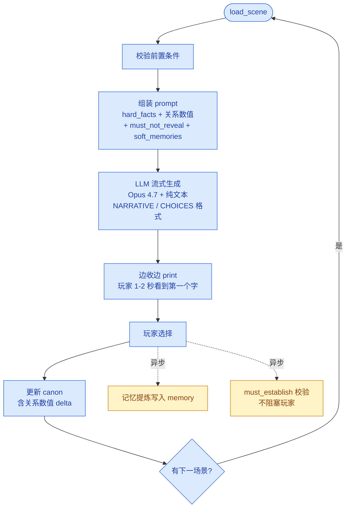

## 名字与初衷

**Lacuna**（拉丁语）：空白、缺口、间隙。

视觉小说一直面临一个老问题：作者写得越细，玩家选择的真实重量越轻——大量分支变成假分支。但完全交给 LLM 自由生成又会失控：泄露不该泄露的真相、违背角色硬设定、把伏笔写散。

Lacuna 想做的折中是：**作者主动留白，LLM 填补留白，玩家选择决定填法**。LLM 不决定故事走向、不能揭露秘密、不能改写硬事实，只在作者预设的"受控空白"里写细节、对白、变体。

## 三层架构

| 层 | 职责 | 实现位置 |
|---|---|---|
| **Canon（结构化层）** | 角色硬设定、世界观、玩家累计状态、关系数值——每次必带，硬事实绝对优先 | `engine/canon.py` + `content/world.yaml` |
| **Memory（语义层）** | 场景过往的软描写、伏笔——hybrid 召回 = 关键词重叠 × 时间衰减 × 视角可见性 | `engine/memory.py` + `data/memory.db` |
| **Scene Contract（场景契约）** | 作者写的节点骨架——必须发生、不可揭露、NPC 知情边界、关系驱动的语气 | `engine/scene.py` + `content/scenes/` |

三层职责严格分离：Canon 是"硬事实"，Memory 是"软回忆"，Scene Contract 是"作者意图"。LLM 拿到的 prompt 是三层拼装的结果，自由发挥的空间被严格框死。

## 主流水线

同步路径保证体验流畅，异步路径承担记忆累积和质量校验——校验失败时只是 stderr 出一个 `[警告]` 给作者，不阻塞玩家继续玩。

## 实测效果：两段实跑

带 demo《雨后旧校舍》——4 个节点 + 1 个结尾的悬疑短篇。下面是同一玩家的两段实跑（教室追问真由 → 旧校舍门口 → 给日记 → 天台沉默），LLM 实时生成、未经修饰。

### 第二节：关系数值悄悄改了 NPC 的态度

玩家在第一节选了"直接追问真由"，触发 `mayu→player.trust −5 / distance +5`。第二节的脚本没有任何"回响第一节"的指令，但 LLM 主动让真由的态度反映了这个数值差：

> 真由站在台阶下面那一截，没有再往上走，校服裙角被风掀了一下又落下。**先前在教室里，你当着所有人追问过她；她现在的眼神还留着那时候的刺。**
>
> "……你真的要进去。"她的声音被湿风削薄了，"我说过的话，你一句都没听。"

加粗那一句是 LLM 把第一节的具体选择（"当着所有人追问"）织进了第二节的环境描写里——这是 `tone_options` + 关系数值的双驱动效果，作者完全没在第二节脚本里指定回响。

### 第四节：模型自发写出元叙事

玩家累计选择：教室追问 → 等真由 → 给日记。LLM 在第四节一次性回响了**三个具体过往选择**，并主动写出元叙事点题：

> "你来了。"她停顿了很久，像在挑选哪一个字最不会划伤人，"**那天在教室……你问得很直。可你没有逼我。**" 她终于转过身，眼睛比平时低，"**日记你拿给我看的时候，我就该说的。是我没说。**"
>
> ……此刻她看你的方式和那次一样——像在确认你是不是还是那个会沉默、会等她、会把日记摊开放在她面前的人。**她记得。每一步她都记得。** 这件事让你背后发凉，比夜风更凉。

"她记得。每一步她都记得"——这是 LLM 自发的元叙事，不是任何 prompt 里的固定句。引擎给的 RAG 上下文（玩家选择历史 + 关系数值）真的进了模型的语义空间，不只是被复述，而是被**模型自己点了出来**。

> 这两段证明的不是 "LLM 写得好"——任何强模型都能写好文学性文本。它们证明的是引擎架构成立：作者只写了 `must_establish` + `npcs.knows` + `tone_options` + `canon_update.relations` 这几个结构化字段，LLM 就能在严格不泄露真相的前提下，让玩家感觉"她记得我"。

## 工程上的几个权衡

**流式输出 vs JSON schema 严格约束**。选了流式（玩家 1-2 秒看到第一个字 vs schema 校验通过后才能看到全文），靠 system prompt 约定 + Opus 4.7 的指令遵循。代价是偶尔格式跑偏会触发 fallback——可接受。

**must_establish 校验改成异步**。原本想做"漏事实就 retry"，但流式打出去的文本无法收回。改成漏事实只 stderr 出 `[警告]` 不阻塞玩家，作者根据 warning 改进下一版的 `tone_options` / `length_hint` 措辞。

**关键词召回，不是真语义召回**。`recall()` 当前是关键词重叠 + 时间衰减 + 视角可见性的 hybrid scoring。schema 没变，换 embedding 只改一个函数——但当前关键词召回已经够用，没必要先上引擎。

**NPC 知情边界做成场景级**。`npcs.{id}.knows` 和 `does_not_know` 是场景级的覆盖。同一个 NPC 在世界设定里知道某事，但在某个具体场景里不能说——这种"不对称信息"是 VN 推动剧情的核心，很多框架做不出来。

**content / engine 解耦**。改 YAML 就改了故事，引擎一行不动；改引擎，content 不用动。这是整个项目最舒服的设计——一旦定下，后面所有功能都是这个抽象的受益者，作者和工程师可以并行迭代。

## 性能数据

实测 Opus 4.7 + 流式 + low effort：

| 指标 | 数值 |
|---|---|
| 玩家选完 → 看到第一个字 | ~1-2 秒 |
| 第一个字 → 全文打完 | ~5-8 秒（边读边出，无等待感） |

如果默认效果不够好，`.env` 里把 `STORY_GEN_EFFORT` 调到 `medium` 或开 `STORY_GEN_THINKING=adaptive`——质量上来但首字延迟会到 ~10 秒。如果默认还嫌慢，可切到 Haiku 4.5，快 2 倍、质量降一档。

## 怎么扩展

| 想做的事 | 改哪儿 |
|---|---|
| 加一节剧情 | `content/scenes/` 下新建 YAML，让上一节某个 choice 的 `transition` 指过来 |
| 加新角色 | `content/characters/<id>.yaml`，在场景的 `present_characters` 里引用 |
| 改世界观 | `content/world.yaml` 的 `hard_facts` / `forbidden` / `tone_global` |
| 换召回策略 | 替换 `engine/memory.py` 的 `recall()` 方法，schema 不变；上 embedding 就改这一个函数 |
| 接其他模型 | `engine/llm.py` 是适配器，改用 OpenAI SDK 即可接 qwen / gpt 系列 |

整个项目刻意做成"作者只碰 `content/`，工程师只碰 `engine/`"。要扩成完整的 VN 还缺单存档机制、周目机制、Choice Classifier（让玩家自由输入而不只是点编号）——这些都在 roadmap 里。

## 当前状态

当前是接 Anthropic API（Opus 4.7 主生成 + Haiku 4.5 异步校验）的 demo 版本。后续计划是接入本地 LLM——如果你有好的本地模型推荐或想法，欢迎在 GitHub 联系。

[github.com/WizardHeHeJun/Lacuna](https://github.com/WizardHeHeJun/Lacuna)
