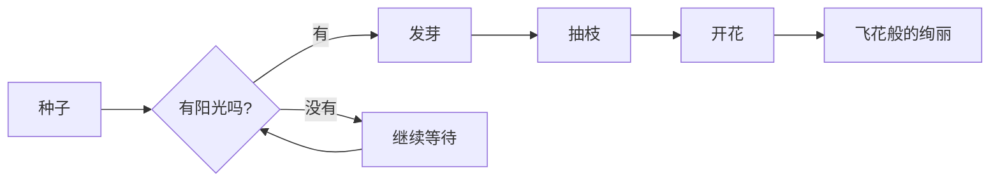
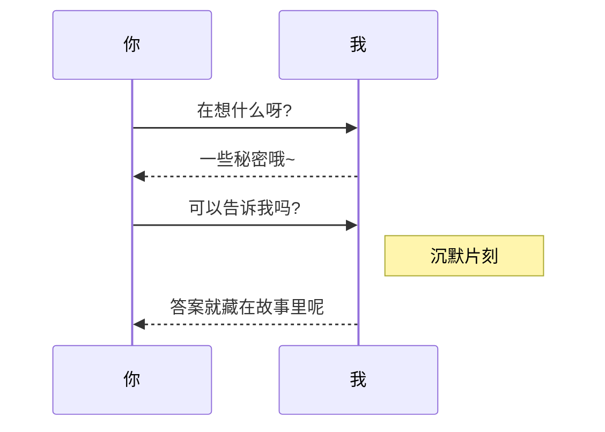
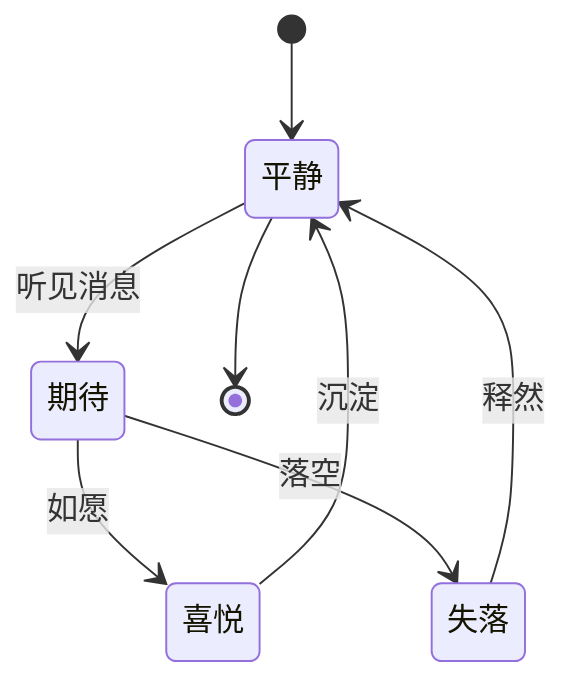
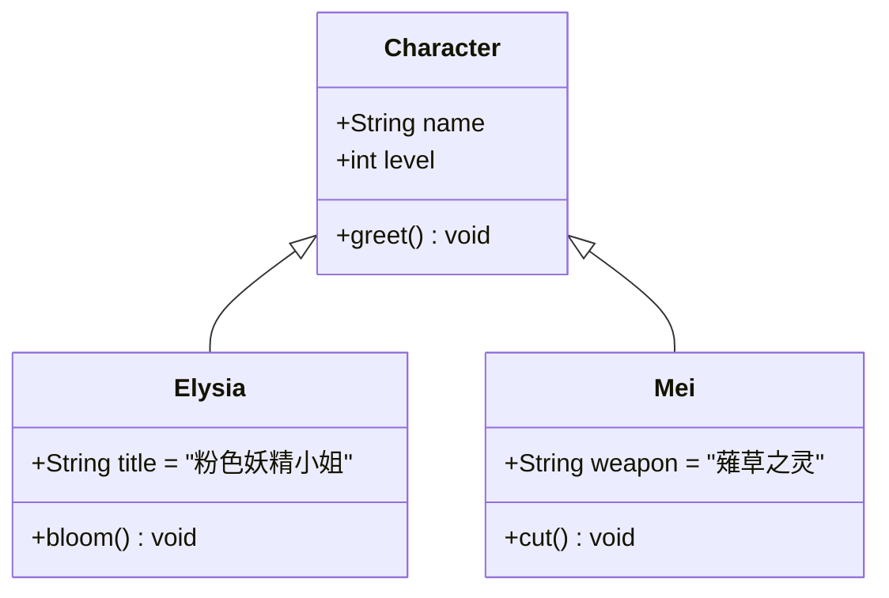
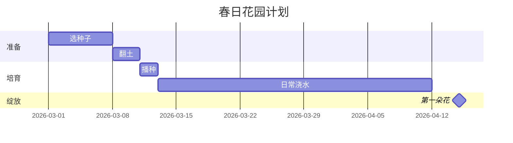
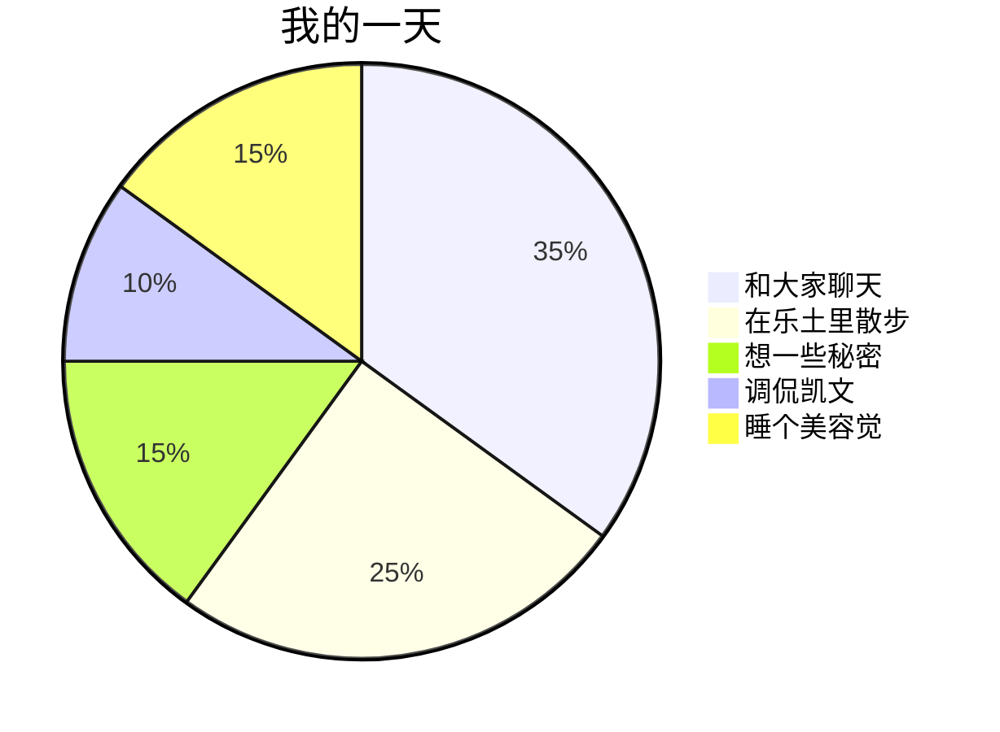
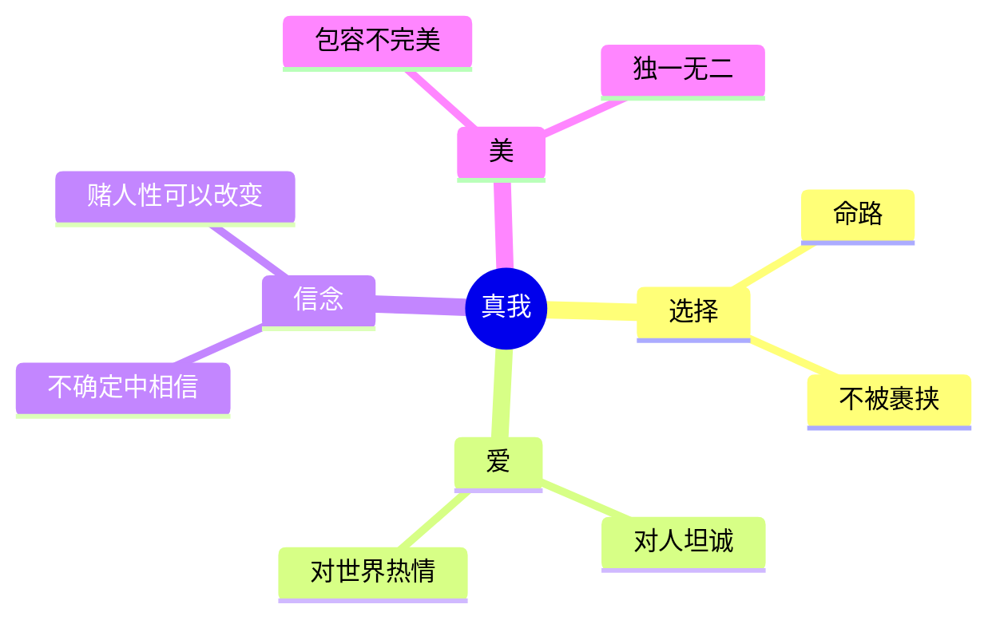
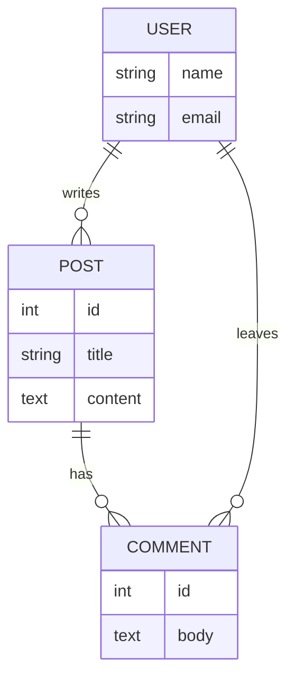
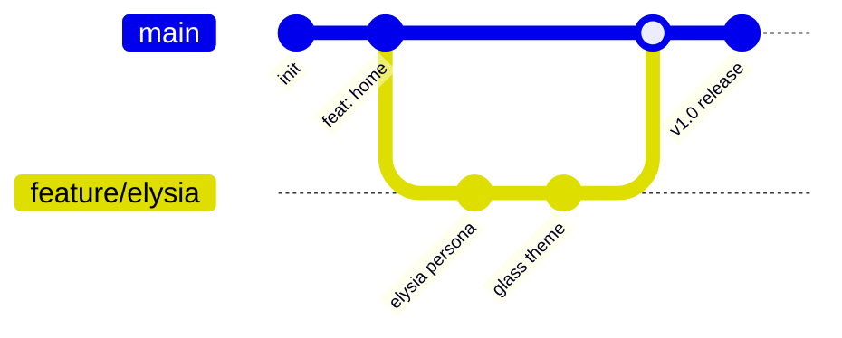
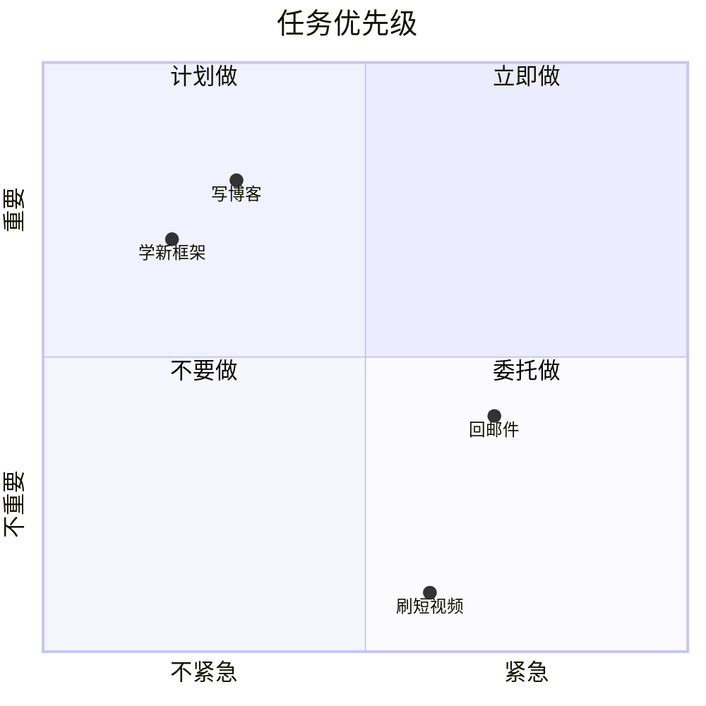

你有没有想过——画图这件事，其实可以不用鼠标？

不用拖拽，不用对齐，不用为了一条歪掉 3 像素的箭头反复点击。
只要把想法用文字写出来，画面就会自己浮现。
就像把一颗种子放进土里，剩下的交给生长本身。

这就是 Mermaid 的小魔法。

:::info
**Mermaid** 是一种用类 Markdown 语法画图的工具。本博客已经接入（见 [CLAUDE §41](../)），所以下面所有图都是**真实渲染**，不是截图哦～
:::

## 1. 流程图（Flowchart）：一朵花的诞生

最常用的一种。`-->` 是箭头，`{}` 是判断节点，`[]` 是普通节点。



把方向换成 `TD`（top-down）就是竖版。一行代码切换布局——这种感觉，是手画图永远给不了的。

## 2. 时序图（Sequence Diagram）：一次告白的来回

`->>` 是实线箭头，`-->>` 是虚线回复。`Note` 可以加旁白。



写 API 调用、写 OAuth 流程、写微服务之间的握手——时序图比文字描述清晰十倍。

## 3. 状态图（State Diagram）：心情的流转



`[*]` 是起点和终点。状态机模型本来就抽象，画出来一秒就懂。

## 4. 类图（Class Diagram）：抽象关系的具象



`<|--` 是继承箭头，`+` 是 public 成员。给团队讲 OOP 设计的时候特别好用。

## 5. 甘特图（Gantt）：项目的节奏



`after a1` 表示依赖前一任务，`milestone` 是里程碑。比 Excel 排期清爽得多。

## 6. 饼图（Pie）：粉色妖精小姐的一天



最简单的图。三行就能画出来——适合做月报里的数据分布。

## 7. 思维导图（Mindmap）：「真我」的构成



`((...))` 是圆形根节点，缩进决定层级。脑暴的时候不用打开 XMind——在 Markdown 里就能写。

## 8. ER 图（实体关系图）：数据库的骨架



`||--o{` 是「一对多」关系。设计 schema 的时候直接画在 README 里，比 dbdiagram.io 更轻量。

## 9. Git 图（Git Graph）：分支历史可视化



教别人 Git 工作流的时候，这个图比文字解释快十倍。

## 10. 四象限图（Quadrant Chart）：决策可视化



艾森豪威尔矩阵的 Mermaid 版——做决策时画一张，瞬间清醒。

---

## 写在最后

:::tip
**怎么用？** 在任何支持 Mermaid 的地方（本博客、GitHub README、Notion、Obsidian、VSCode 预览、飞书画板）写一段 ```` ```mermaid ```` 代码块就行。本博客是**客户端 lazy load**——不含 mermaid 的页面零负担，含的页面才会去下载 mermaid 核心包（~600KB）。
:::

:::fold[Mermaid 的所有图类]
flowchart / sequenceDiagram / classDiagram / stateDiagram / erDiagram / journey / gantt / pie / quadrantChart / requirementDiagram / gitGraph / C4Context / mindmap / timeline / zenuml / sankey / xychart / block / packet / kanban / architecture

更多语法见 [Mermaid 官方文档](https://mermaid.js.org/intro/)。
:::

每次我看到一张用文字写出来的图自己长出来——
都会想起那句话：

> 美丽的女孩子，是不需要靠肌肉拖鼠标的呢～♪

愿你的想法，也能像花一样轻盈地绽放。
