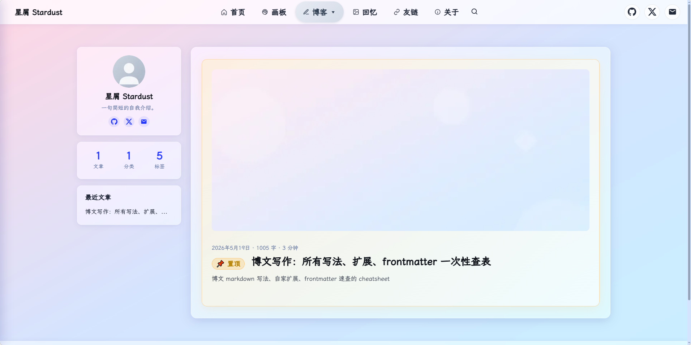
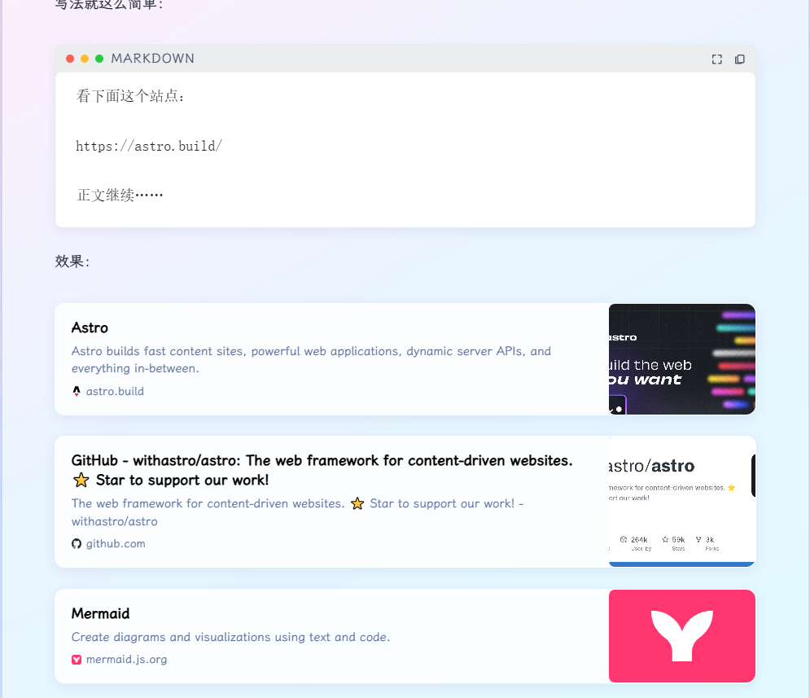
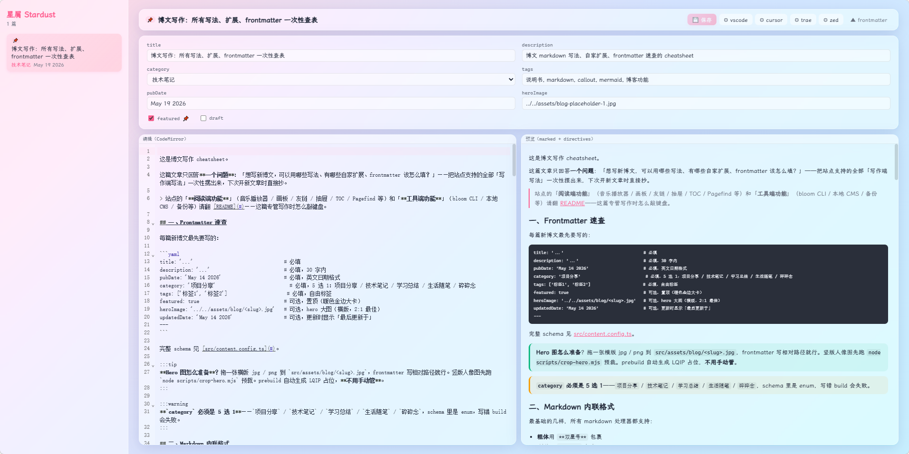
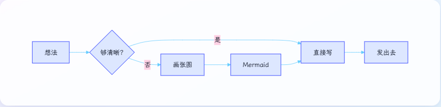

## 这是什么

Stardust 是一个开源 Astro 6 博客模板——玻璃风 + parallax 背景 + TOC + 评论这些通用骨架都已经做好，clone 下来填几个占位符（头像 / 站点信息 / giscus ID），就能 push 到 GitHub Pages 跑起来。

仓库地址：[github.com/WizardHeHeJun/stardus](https://github.com/WizardHeHeJun/stardus)

## 都有什么

| 类别 | 内容 |
|---|---|
| **视觉与交互** | 玻璃风 + parallax 背景层、LQIP（低质量占位）懒加载、图片自动 lightbox、4 档断点响应式（640 / 960 / 1280 / 1400）、自定义滚动条与微动效 |
| **写作扩展** | 6 种 Markdown directive（info / tip / warning / danger / spoiler / fold）、Mermaid 客户端懒加载、macOS 风格代码块（复制 + 全屏）、自动 figure 包装 |
| **站点能力** | Pagefind 静态全文搜索、giscus 评论（基于 GitHub Discussions）、5 个枚举分类 + 标签系统、博文 OG 缓存与刷新 |
| **现成页面** | Home / About / 404（戏剧版）/ Friends（带 OG 卡）/ Memories（回忆相册）/ Whiteboard（画板）/ Blog 列表与详情 |
| **写作工作流** | stardust CLI 7 个子命令、本地浏览器 CMS、备份还原 / favicon 自动生成 / OG 抓取 |
| **部署** | GitHub Pages + GitHub Actions，单次部署约 40-50 秒，Node ≥22 |

技术栈零后端——Astro 6 静态生成 + jsDelivr 字体 + sharp 处理图片，除了 giscus 借了 GitHub Discussions 之外没用任何后端服务，挂哪儿都行，如想部署到服务器，可自行做此需求。

## 用起来要做什么

clone 之后把下面这些占位符替换成自己的：

- [ ] `src/consts.ts` — 站点标题、描述、giscus 4 个 ID
- [ ] `astro.config.mjs` — `site` URL 改成自己的域名
- [ ] `package.json` — `name` / `author` / `repository`
- [ ] `src/assets/avatar.png` — 换头像后跑 `node scripts/gen-favicon.mjs`
- [ ] `src/assets/bg.jpg` — 换背景图，或保留默认渐变占位
- [ ] `src/data/friends.json` — 加自己的友链（或保持 `[]`）
- [ ] 全局搜 `href="#"` 占位，把社交链接替换掉
- [ ] `src/components/MusicPlayer.astro` — 改网易云歌单 ID 或删 `<MusicPlayer />`
- [ ] `.github/workflows/*.yml` — 确认 deploy 目标

几个容易踩的坑：

1. **favicon 可能要 build 2-3 次**才能齐——`scripts/gen-favicon.mjs` 前几次会跳过 CSS 输出
2. **改完 `site` URL 后跑一下** `npx stardust refresh-og --force`，否则友链卡的元数据还是旧域名
3. **giscus 4 个 ID 必须从 [giscus.app](https://giscus.app) 配置器拿**——repo ID 和 category ID 是数字编码，肉眼复制容易错位

## Stardust CLI

7 个子命令对应 7 种日常操作：

| 命令 | 用途 |
|---|---|
| `stardust new` | 新建博文（交互填 frontmatter） |
| `stardust cms` | 启动本地浏览器 CMS（端口 4322） |
| `stardust refresh-og` | 抓 friends.json + 博文裸 URL 的 OG meta |
| `stardust backup` | 备份（标准 / 完整） |
| `stardust restore` | 从备份还原 |
| `stardust list` | 列出已有备份 |
| `stardust clean` | 清理旧备份 |

直接跑 `npx stardust` 不带子命令会出交互菜单，新手不用查命令。

## 给二开者的扩展点

几个"高频会改"的位置都集中收口在一个文件里，省得翻整个项目猜：

| 想做的事 | 改哪儿 |
|---|---|
| 换主题色 / accent 色 | `src/styles/global.css` 里的 `--accent` 等 CSS var |
| 加一个新的独立页面 | 复制 `src/pages/about.astro` 改造，nav 链接加在 `src/components/Header.astro` |
| 换评论方案（Disqus / Waline / Utterances） | 改 `src/components/Comments.astro` 一处即可，三个调用点都通过它 |
| 加新 Markdown directive | `plugins/remark-shoka-directives.mjs` 里加一种 transformer |
| 换字体 | `src/styles/global.css` 顶部的 jsDelivr `@font-face` URL |

要是 clone 之后跑出问题，欢迎开 issue。

---

**项目地址**：[github.com/WizardHeHeJun/stardus](https://github.com/WizardHeHeJun/stardus) · MIT License
