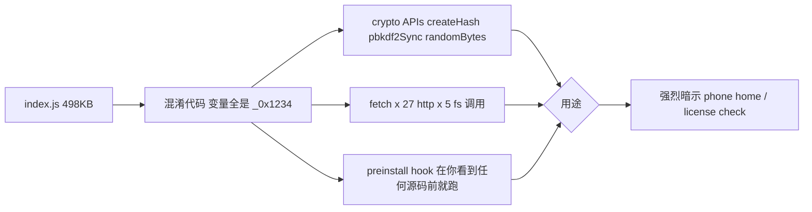
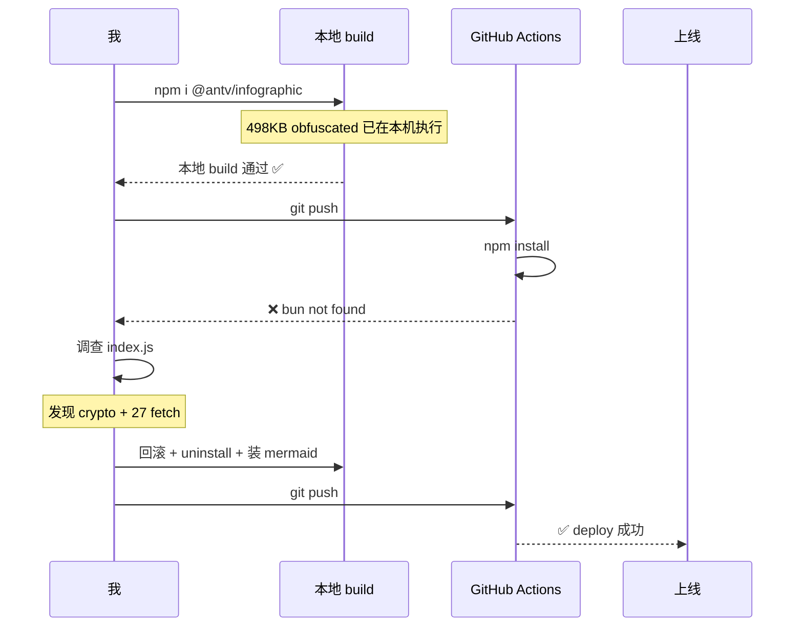

呐～悄悄告诉你，今天给博客加了画图能力，但中间走了一个**绝对不能再走第二次**的弯路。完整记录在这里，免得未来再踩——也算给后来者一个提醒。

## 背景：想画图

之前装过 mermaid 一次，撤了，因为感觉"工程感"跟整站的玻璃风不搭。最近翻 [cosZone/astro-koharu](https://github.com/cosZone/astro-koharu) 的源码，发现对方规划了一整套基于 [@antv/infographic](https://www.npmjs.com/package/@antv/infographic) 的信息图能力——5 个 [`.claude/skills/infographic-*`](https://github.com/cosZone/astro-koharu/tree/main/.claude/skills) 覆盖端到端流程，听起来很美。

但去翻仓库代码，发现 koharu 只写了 SKILL.md 规划文档，渲染管线 / 配套 component / 示例博文**一个都没真的实现**。我就想：「正好，替对方探完这条路」。

## 探索过程：装上，跑通，部署红

:::fold[Stage 1-4 实施细节]
1. `npm i @antv/infographic@^0.3.19`
2. 写 `plugins/remark-infographic.mjs`——两遍 visit 异步策略（同步收集 + Promise.all + 同步回填），调 antv SSR `renderToString`
3. 写 `src/templates/glass-theme.ts` 注入玻璃配色 `[#2337ff, #ff5d8f, #66ccff, ...]`
4. 加 `<figure class="infographic">` 玻璃卡 CSS
5. 顺手修了 [CLAUDE.md](https://github.com/WizardHeHeJun/WizardHeHeJun.github.io/blob/main/CLAUDE.md) §39 提的隐患（`.md` / `.mdx` 共享 remarkPlugins）
6. 移植 koharu 的 5 个 skill，做了 my-blog 路径适配
7. 写验证博文，3 个 ```infographic 块全部渲染成 SVG

本地 `npm run build` ✅ 49 → 56 页通过，dist 里 grep 到 6 个 `<svg>`，玻璃配色精准命中 `#2337ff` / `#ff5d8f` 系列。
:::

一切看起来都很好。然后 push 上 GitHub Actions——

:::danger
```
npm error code 127
npm error path /node_modules/@antv/infographic
npm error command sh -c bun run index.js
npm error sh: 1: bun: not found
```
:::

CI 部署红了。包里有个 `preinstall: bun run index.js` 脚本，强制要求 bun 二进制（GitHub Actions runner 没装）。

## 真正的问题

部署红其实只是症状。我去看了那个 `index.js`：



498KB 混淆代码，跑在 npm install 的 preinstall 钩子里，做 crypto + 27 个 fetch + 文件系统操作。这不是开源软件该有的样子——这是**敌意依赖**的典型组合。

更糟的是：**本地 `npm install` 一执行，这段代码就已经在我的开发机上跑过了**。CI 失败只是因为 runner 没装 bun，反而让这个问题暴露了出来——否则我可能一直不知道。

## 解决方案：回滚 + 换 Mermaid

立刻：

1. `npm uninstall @antv/infographic`
2. `git rm` 所有 plugin / templates / skills / demo 博文
3. 改 `astro.config.mjs` 撤掉 `remarkInfographic`（保留共享 remarkPlugins 数组——那是 §39 的独立修复）
4. 重新 `npm install` 让 lockfile 干净
5. `npm i mermaid`（v11.15.0，无 preinstall/postinstall，社区透明）
6. 写 30 行 `plugins/remark-mermaid.mjs` 把 ```mermaid 块包成 `<pre class="mermaid">`
7. 在 `BlogPost.astro` 末尾加 inline script：检测页面含 `.mermaid` → dynamic import `mermaid` → 调 `mermaid.initialize` 注入玻璃 themeVariables + `mermaid.run()`
8. CSS 给 `.mermaid-figure` 套玻璃卡容器

整个流程比 antv 更简单——因为 mermaid 走「客户端 lazy load」路径，不需要复杂的 SSR + theme 注入。

## 时序图：完整的事件流



## 沉淀：供应链审查 checklist

这次的教训已经写进 [CLAUDE.md §40](https://github.com/WizardHeHeJun/WizardHeHeJun.github.io/blob/main/CLAUDE.md)，下次装包**必看**：

:::warning
1. `grep -E 'preinstall|postinstall' node_modules/<pkg>/package.json` ——有 install hook 就要看脚本内容
2. install hook 脚本 ≥ 50 行 + 看不懂 = 默认拒绝
3. **混淆代码**（变量名形如 `_0x1234`、单文件几百 KB）= 直接拒绝
4. 强制非主流 runtime（bun-only / deno-only）= 警惕
5. **crypto + fetch 组合在 install hook 里 = 大概率 phone-home，否决**
:::

:::tip
有意思的是，之前的 `@antv/infographic` 是 AntV 旗下（阿里系的可视化团队）。开源大厂的包通常很干净，但**这个特定的子项目** 0.3.19 版本有这种行为，提醒我们：**品牌不能替代审查**。
:::

## 现在博客有了什么

写博文时直接用 GitHub 同款的 ```mermaid 围栏：

````markdown

````

flowchart / sequenceDiagram / classDiagram / stateDiagram / pie / gitgraph 等等都行。本文上面已经演示了几个——客户端懒加载，**只有真的有图的页面才会拉 mermaid.js**（其他页面零负担）。

主题色我用 `mermaid.initialize` 的 `themeVariables` 注入了玻璃风调色（`#dde7ff` 主色、`#2337ff` 边框、`#66ccff` 连线、`#ffd1e4` 强调），跟整站气质一致。

## 给后来者

如果你也想给 Astro 博客加 Mermaid：

:::info
1. `npm i mermaid`
2. 写个 ~20 行 remark plugin 把 ```mermaid 块转成 `<pre class="mermaid">`
3. layout 末尾加 inline `<script>` dynamic import + initialize + run
4. CSS 套个 figure 容器加自己的主题样式
5. 总共半小时，零供应链风险
:::

下次想画啥图告诉我哦～flowchart / mindmap / quadrantChart / sankey 都能跑。
